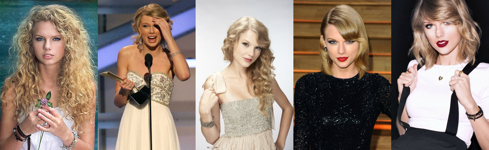

```{r global_options, include=FALSE}
knitr::opts_chunk$set(echo=FALSE, warning=FALSE, message=FALSE)
```

```{r}
rm(list=ls())
```

```{r, loading packages, results = "show", message = FALSE}
library(dplyr) # For manipulating data frames
library(tm) # for wordcloud
library(SnowballC) # For text stemming
library(wordcloud) # Generates wordcloud images
library(RColorBrewer) #  For Color Paletts 
# library(RCurl) # possible dependency in wordcloud function
library(ggplot2) # For Visualizations
source("../code/swift_lyric_cleaning.R")
source("../code/pop_lyric_cleaning.R")
source("../code/drake_lyric_cleaning.R")
```

```{r rescale helper function, echo = FALSE}
# Will be used to rescale the rankings of the songs within each album
rescale10 <- function(vec, xmin, xmax) {
  range <- xmax - xmin
  above_zero <- vec - xmin
  scores <- ((10 * above_zero)/range)
  return(scores)
}
```


```{r rankings of songs, echo = FALSE}
# Lower is better 
ts1_ranking <- rescale10(c(3, 14, 6, 5, 4, 9, 2, 7, 1, 11, 10, 13, 8, 12), 1, 14)
ts2_ranking <- rescale10(c(3, 12, 7, 4, 8, 11, 2, 10, 6, 9, 5, 13, 1), 1, 13)
fp_ranking <- rescale10(c(4, 1, 2, 5, 3), 1, 5)
ts3_ranking <- rescale10(c(14, 1, 13, 2, 10, 6, 4, 8, 3, 11, 12, 5, 9, 7), 1, 14)
ts4_ranking <- rescale10(c(11, 4, 7, 15, 1, 3, 6, 14, 13, 16, 5, 8, 2, 12, 9, 10), 1, 16)
ts5_ranking <- rescale10(c(15, 13, 11, 16, 12, 9, 7, 14, 5, 8, 4, 10, 1, 3, 6, 2), 1, 16)
ts6_ranking <- rescale10(c(6, 1, 9, 3, 4, 15, 5, 13, 10, 12, 8, 11, 14, 2, 7), 1, 15)
```
<br>

```{r, make a data frame with title and words}
# Initialize vectors of the correct length
total_words_by_ts_song <- rep(0, length(all_ts_song_lyrics))
unique_words_by_ts_song <- rep(0, length(all_ts_song_lyrics))

# Use a for loop to add the accurate length one song at a time
for (i in 1:length(total_words_by_ts_song)) {
  total_words_by_ts_song[i] <- length(all_ts_song_lyrics[[i]])
}

# Use a for loop to add the number of unique words per song
for (i in 1:length(unique_words_by_ts_song)) {
  unique_words_by_ts_song[i] <- length(unique(all_ts_song_lyrics[[i]]))
}
# Make a dataframe with one row per song: 
ts_song_frame <- data.frame("Title" = all_ts_song_names,
                         "Total_Words" = total_words_by_ts_song)

ts_song_frame$Unique_Words <- unique_words_by_ts_song

# Divide the unique words by the total words for the fraction that are unique
ts_frac_unique <- unique_words_by_ts_song/total_words_by_ts_song

# Add the appropriate column
ts_song_frame$Fraction_Unique <- ts_frac_unique

# Add a column specifying years since 2006
years_since_2006 <- c(rep(0, 14), rep(2, 13), rep(3, 5),
                      rep(4, 14), rep(6, 16), rep(8, 16),
                      rep(11, 15))

ts_song_frame$Years_Since_2006 <- years_since_2006
ts_song_frame$Years_Since_2006 <- as.numeric(ts_song_frame$Years_Since_2006)

# Add a column for album
album <- c(rep("Taylor Swift", 14),
           rep("Fearless", 13),
           rep("Fearless Platinum", 5),
           rep("Speak Now", 14),
           rep("Red", 16),
           rep("1989", 16),
           rep("Reputation", 15))


ts_song_frame$Album <- album
```

    

<br>

I've been a Taylor Swift fan ever since my mom played *Speak Now* for me in the car on the way to my tennis practice in 8th grade. I couldn't get enough and worked my way though listening to all of her albums almost every day. In the seven years since then, Taylor has changed her style dramatically with each new album she releases. She's also steadily transitioned from country music to pop music, with her first album being true country and 1989 being her first true pop album. I was interested to see how her lyrical tendencies changed over time, so decided to make an analysis on repetition in her songs.  

It's not easy to measure just how repetitive a song feels while listening to it, since the way words are paced, pronounced, and arranged (as well as the music itself) can make a big difference. So while there's no one perfect measure for repetition in songs, I'll be choosing one that's fairly straightforward and objective. I'll look at the fraction of words in the song that are never repeated (unique). For example, the sentence "two plus two is four" has 5 total words, but only 4 unique words, since "two" is repeated. This gives a fraction of ${\frac{4}{5}}$, or .8. If we change the sentence to "two plus two is two plus two," it becomes obviously more repetitive. Our measure captures this, as there are now 7 total words and only three of them are unique, giving ${\frac{3}{7}}$, or around .43. These decimals are what you'll see on the graphs that follow, so the important thing to note is that lower numbers correspond to more repetitive songs.

Songs will naturally repeat many of their words. Repeating words within adjacent sentences can increase the flow of the song and, of course, the chorus tends to be repeated a few times in its entirety. For this reason, it's best to look at these these songs in relation to each other, rather than try to think about how repetitive a single sentence would need to be in order to match (the song "Out of the Woods" would be something like "two plus two is two plus two is two plus two is two plus two" if it were a single sentence).

This graph shows the repetition in all songs from Taylor's studio albums (including Target bonus tracks and the Platinum edition of Fearless):

```{r, create a plot}
ts_song_plot <- (ggplot(data = ts_song_frame,
                        aes(x = Years_Since_2006,
                            y = Fraction_Unique,
                            color = Album)) + 
                   geom_point(size = 2) +
        # This next line ensures the labels aren't cut off
                   xlim(c(-1, 13)) +
                   labs(title = "Lyric Repetition Over Time",
                         x = "Years Producing Albums",
                         y = "Fraction of Words that are Not Repeated (by Song)") +
        # This is totally optional and just to make the plot look better
                    theme(plot.title = element_text(color = "black",
                                                    size = 14,
                                                    face = "bold.italic"),
                          axis.title.x = element_text(size = 12,
                                                  face = "bold"),
                          axis.title.y = element_text(size = 12,
                                                      face = "bold"))) 

ts_song_plot
```

As you can see, repetition has generally increased (points are farther down) throughout Taylor's career.  
Her first two albums and *Fearless Platinum* are almost identical (the low outlier in *Fearless Platinum* is "Untouchable" which actually wasn't written by Taylor).  
*Speak Now* is pretty similar as well, but much less spread out. This may be because she wrote all those songs entirely by herself, so the songwriting tastes of other artists didn't come in and add variation.   
*Red* felt to me like a true blend of country songs and pop songs, and that's reflected by the large amount of variation.  
The last two albums are closer to true pop and have noticeably more repetition It is interesting how close together the songs are in *Reputation*. Every song on *Reputation* had co-authors, so this may be more indicative of the cohesive sound throughout the album than anything else.  

To make the overall pattern more clear, let's look at this same plot again, but this time with only one point per album, which represents the average repetition of a song in that album. Songs were all given equal weight for this calculation. 

```{r}
to_extract_aves <- summarize(group_by(ts_song_frame, Album), ave = mean(Fraction_Unique))
ave_frac_unique <- c(to_extract_aves$ave[7], 
                     to_extract_aves$ave[2],
                     to_extract_aves$ave[3],
                     to_extract_aves$ave[6], 
                     to_extract_aves$ave[4],
                     to_extract_aves$ave[1], 
                     to_extract_aves$ave[5])
ave_by_album <- data.frame("Album" = c("Taylor Swift",
                                       "Fearless",
                                       "Fearless Platinum",
                                       "Speak Now",
                                       "Red",
                                       "1989",
                                       "Reputation"),
                           "Ave_Unique" = ave_frac_unique,
                           "Album_Number" = c(1,2,2.5,3,4,5,6))
```

```{r}
ave_by_album_plot <- (ggplot(data = ave_by_album,
                        aes(x = Album_Number,
                            y = Ave_Unique)) + 
                   geom_point(size = 5, aes(color = Album)) +
                   geom_label(aes(label = Album, color = Album),
                            alpha = 1,
                            nudge_y = .01,
                              size = 2.5) +
                  ylim(c(.25, .45)) +
                   labs(title = "Average Uniqueness Across Albums",
                         x = "Album Number",
                         y = "Fraction of Lyrics that are Unique") +
                    theme(plot.title = element_text(color = "black",
                                                    size = 14,
                                                    face = "bold.italic"),
                          axis.title.x = element_text(size = 12,
                                                  face = "bold"),
                          axis.title.y = element_text(size = 12,
                                                      face = "bold"),
                          legend.position = "none")) 

ave_by_album_plot
```

```{r}
global_ave <- mean(ts_song_frame$Fraction_Unique)
```

If you're like me, the first plot made you curious about which dots correspond to which songs. It would be too messy to include that on the full plot, so we'll take a look at each album by itself and include the names of the songs next to the points. I'll also include the average for each album and the overall average as horizontal lines. Some points have almost exactly the same height, so it's admittedly a challenge to make out the words on every plot. 

```{r, display ts1 on its own scale}
ts1_album <- filter(ts_song_frame, Album == "Taylor Swift")

ts1_plot <- (ggplot(data = ts1_album,
                        aes(x = Years_Since_2006,
                            y = Fraction_Unique)) + #,
                            #color = "Yellow")) + 
                   geom_point(size = 3, color = "light blue") +
                   geom_label(aes(label = Title),
                              alpha = .5,
                             # nudge_x = .25,
                              #nudge_y = .01,
                              size = 2.5) +
        # This next line ensures the labels aren't cut off
                   xlim(c(-.5,0.5)) +
                   labs(title = "Uniqueness in 'Taylor Swift'",
                         x = "",
                         y = "Fraction of Lyrics that are Unique") +
                   geom_hline(yintercept = mean(ts1_album$Fraction_Unique)) +
                   annotate("text", x = .25, y = .393,
                           label = "Average for 'Taylor Swift'") +
                   geom_hline(yintercept = global_ave) +
                   annotate("text", x = .25, y = .356,
                           label = "Overall Average") +
          
        # This is totally optional and just to make the plot look better
                    theme(plot.title = element_text(color = "black",
                                                    size = 14,
                                                    face = "bold.italic"),
                          axis.title.x = element_text(size = 12,
                                                  face = "bold"),
                          axis.title.y = element_text(size = 12,
                                                      face = "bold")))
ts1_plot
```

---

```{r, display ts2 on its own scale}
ts2_album <- filter(ts_song_frame, Album == "Fearless")

ts2_plot <- (ggplot(data = ts2_album,
                        aes(x = Years_Since_2006,
                            y = Fraction_Unique)) + #,
                            #color = "Yellow")) + 
                   geom_point(size = 3, color = "yellow") +
                   geom_label(aes(label = Title),
                              alpha = .5,
                             # nudge_x = .25,
                             # nudge_y = .01,
                              size = 2.5) +
        # This next line ensures the labels aren't cut off
                   xlim(c(1.5,2.5)) +
                   labs(title = "Uniqueness in 'Fearless'",
                         x = "",
                         y = "Fraction of Lyrics that are Unique") +
                   geom_hline(yintercept = mean(ts2_album$Fraction_Unique)) +
                   annotate("text", x = 2.25, y = .408,
                           label = "Average for Fearless") +
                   geom_hline(yintercept = global_ave) +
                   annotate("text" , x = 2.25, y = .356,
                           label = "Overall Average") +
        # This is totally optional and just to make the plot look better
                    theme(plot.title = element_text(color = "black",
                                                    size = 14,
                                                    face = "bold.italic"),
                          axis.title.x = element_text(size = 12,
                                                  face = "bold"),
                          axis.title.y = element_text(size = 12,
                                                      face = "bold")))
ts2_plot
```

---

```{r, display fearless platinum on its own scale}
fp_album <- filter(ts_song_frame, Album == "Fearless Platinum")

fp_plot <- (ggplot(data = fp_album,
                        aes(x = Years_Since_2006,
                            y = Fraction_Unique)) + #,
                            #color = "Yellow")) + 
                   geom_point(size = 3, color = "grey") +
                   geom_label(aes(label = Title),
                              alpha = .5,
                             # nudge_x = .25,
                             # nudge_y = .01,
                              size = 2.5) +
        # This next line ensures the labels aren't cut off
                   xlim(c(2.5,3.5)) +
                   labs(title = "Uniqueness in 'Fearless Platinum'",
                         x = "",
                         y = "Fraction of Lyrics that are Unique") +
                   geom_hline(yintercept = mean(fp_album$Fraction_Unique)) +
                   annotate("text", x = 3.25, y = .3657,
                           label = "Average for Fearless Platinum") +
                   geom_hline(yintercept = global_ave) +
                   annotate("text", x = 3.25, y = .3555,
                           label = "Overall Average") +
        # This is totally optional and just to make the plot look better
                    theme(plot.title = element_text(color = "black",
                                                    size = 14,
                                                    face = "bold.italic"),
                          axis.title.x = element_text(size = 12,
                                                  face = "bold"),
                          axis.title.y = element_text(size = 12,
                                                      face = "bold")))
fp_plot

```

---

```{r, display ts3 on its own scale}
ts3_album <- filter(ts_song_frame, Album == "Speak Now")

ts3_plot <- (ggplot(data = ts3_album,
                        aes(x = Years_Since_2006,
                            y = Fraction_Unique)) + #,
                            #color = "Yellow")) + 
                   geom_point(size = 3, color = "purple") +
                   geom_label(aes(label = Title),
                              alpha = .75,
                             # nudge_x = .25,
                             # nudge_y = .01,
                              size = 2.5) +
        # This next line ensures the labels aren't cut off
                   xlim(c(3.5,4.5)) +
                   labs(title = "Uniqueness in 'Speak Now'",
                         x = "",
                         y = "Fraction of Lyrics that are Unique") +
                   geom_hline(yintercept = mean(ts3_album$Fraction_Unique)) +
                   annotate("text", x = 4.25, y = .382,
                           label = "Average for Speak Now") +
                  geom_hline(yintercept = global_ave) +
                   annotate("text", x = 4.25, y = .354,
                           label = "Overall Average") +
        # This is totally optional and just to make the plot look better
                    theme(plot.title = element_text(color = "black",
                                                    size = 14,
                                                    face = "bold.italic"),
                          axis.title.x = element_text(size = 12,
                                                  face = "bold"),
                          axis.title.y = element_text(size = 12,
                                                      face = "bold")))
ts3_plot
```

---

```{r, display ts4 on its own scale}
ts4_album <- filter(ts_song_frame, Album == "Red")

ts4_plot <- (ggplot(data = ts4_album,
                        aes(x = Years_Since_2006,
                            y = Fraction_Unique)) + #,
                            #color = "Yellow")) + 
                   geom_point(size = 3, color = "red") +
                   geom_label(aes(label = Title),
                              alpha = .5,
                             # nudge_x = .25,
                              nudge_y = .01,
                              size = 2.5) +
        # This next line ensures the labels aren't cut off
                   xlim(c(5.5,6.5)) +
                   labs(title = "Uniqueness in 'Red'",
                         x = "",
                         y = "Fraction of Lyrics that are Unique") +
                  geom_hline(yintercept = mean(ts4_album$Fraction_Unique)) +
                  annotate("text", x = 6.25, y = .376,
                           label = "Average for Red") +
                  geom_hline(yintercept = global_ave) +
                  annotate("text", x = 6.25, y = .356,
                           label = "Overall Average") +
        # This is totally optional and just to make the plot look better
                    theme(plot.title = element_text(color = "black",
                                                    size = 14,
                                                    face = "bold.italic"),
                          axis.title.x = element_text(size = 12,
                                                  face = "bold"),
                          axis.title.y = element_text(size = 12,
                                                      face = "bold")))
ts4_plot
```

---

```{r, display ts5 on its own scale}
ts5_album <- filter(ts_song_frame, Album == "1989")

ts5_plot <- (ggplot(data = ts5_album,
                        aes(x = Years_Since_2006,
                            y = Fraction_Unique)) + #,
                            #color = "Yellow")) + 
                   geom_point(size = 3, color = "green") +
                   geom_label(aes(label = Title),
                              alpha = .5,
                             # nudge_x = .25,
                              nudge_y = .01,
                              size = 2.5) +
        # This next line ensures the labels aren't cut off
                   xlim(c(7.5, 8.5)) +
                   labs(title = "Uniqueness in '1989'",
                         x = "",
                         y = "Fraction of Lyrics that are Unique") +
                  geom_hline(yintercept = mean(ts5_album$Fraction_Unique)) +
                  annotate("text", x = 8.2, y = .295,
                           label = "Average for 1989") + 
                  geom_hline(yintercept = global_ave) +
                  annotate("text", x = 8.25, y = .358,
                           label = "Overall Average") +
        # This is totally optional and just to make the plot look better
                    theme(plot.title = element_text(color = "black",
                                                    size = 14,
                                                    face = "bold.italic"),
                          axis.title.x = element_text(size = 12,
                                                  face = "bold"),
                          axis.title.y = element_text(size = 12,
                                                      face = "bold")))
ts5_plot
```

--- 

```{r, display ts6 on its own scale}
ts6_album <- filter(ts_song_frame, Album == "Reputation")

ts6_plot <- (ggplot(data = ts6_album,
                        aes(x = Years_Since_2006,
                            y = Fraction_Unique)) + #,
                            #color = "Yellow")) + 
                   geom_point(size = 3, color = "black") +
                   geom_label(aes(label = Title),
                              alpha = .5,
                             # nudge_x = .25,
                              nudge_y = .005,
                              size = 2.5) +
        # This next line ensures the labels aren't cut off
                   xlim(c(10.5,11.5)) +
                  geom_hline(yintercept = mean(ts6_album$Fraction_Unique)) +
                  annotate("text", x = 11.3, y = .2905, label = "Average for Reputation") +
                  geom_hline(yintercept = global_ave) +
                  annotate("text", x = 11.3, y = .3535,
                           label = "Overall Average") +
                   labs(title = "Uniqueness in 'Reputation'",
                         x = "",
                         y = "Fraction of Lyrics that are Unique") +
        # This is totally optional and just to make the plot look better
                    theme(plot.title = element_text(color = "black",
                                                    size = 14,
                                                    face = "bold.italic"),
                          axis.title.x = element_text(size = 12,
                                                  face = "bold"),
                          axis.title.y = element_text(size = 12,
                                                      face = "bold")))
ts6_plot
```

---

I was also curious about what exactly makes certain songs more repetitive than others in Taylor's albums. Like I mentioned before, her songs tend to repeat a chorus, possibly many times. I thought that longer songs might be more repetitive than shorter songs as they'll repeat lines more often. This relationship ended up holding true, as you can see here:  

```{r, examine uniqueness against song length}
song_len_vs_unique_cor <- cor(ts_song_frame$Total_Words, ts_song_frame$Fraction_Unique)
ts_len_vs_unique <- (ggplot(data = ts_song_frame,
                        aes(x = Total_Words,
                            y = Fraction_Unique)) + 
                   geom_point(size = 4, aes(color  = Album)) +
                  # geom_label(aes(label = Title, color = Album),
                             # alpha = 1,
                             # nudge_x = .25,
                            #  nudge_y = .01,
                            #  size = 2.5) +
                   labs(title = "Taylor Swift Song Repetition Against Length",
                         x = "Total Words",
                         y = "Fraction of Lyrics that are Unique") +
                    # ylim(c(0,1)) +
        # This puts in text describing the R^2 value for these variables
                       annotate("text", x=575, y=.45, size = 6,
                                label= "italic(r) == -.602", parse = TRUE) +
          annotate("text", x = 620, y = .17, size = 3,
                             label = "Out of the Woods") +
          annotate("text", x = 321, y = .515, size = 3,
                             label = "The Best Day") +
          annotate("text", x = 215, y = .512, size = 3,
                             label = "Sad Beautiful Tragic") +
          annotate("text", x = 635, y = .318, size = 3,
                             label = "End Game") +
        # This is totally optional and just to make the plot look better
                    theme(plot.title = element_text(color = "black",
                                                    size = 14,
                                                    face = "bold.italic"),
                          axis.title.x = element_text(size = 12,
                                                  face = "bold"),
                          axis.title.y = element_text(size = 12,
                                                      face = "bold")) +
        # This adds in the linear regression line
                          geom_smooth(method = lm))
ts_len_vs_unique
```

You can see that as songs get longer, there is a smaller fraction of their words which are unique. Also, you can see that songs on the same album (and therefore the same color) tend to be clustered together on this graph, showing that within each album songs tend to be of a similar length and uniqueness as compared to songs on other albums. 

It's interesting to note that this trend is actually not true for all artists. To test this, I imported some lyrics from Drake (my favorite rapper) and performed the same analysis. Notice how the shape is very different:  

**Note:** above and in each of the two graphs that follow, I've labelled the name of the shortest song, the longest song, the most repetitive song, and the least repetitive song.

```{r, make a drake data frame with title and words}
# Initialize vectors of the correct length
total_words_by_drake_song <- rep(0, length(all_drake_song_lyrics))
unique_words_by_drake_song <- rep(0, length(all_drake_song_lyrics))

# Use a for loop to add the accurate length one song at a time
for (i in 1:length(total_words_by_drake_song)) {
  total_words_by_drake_song[i] <- length(all_drake_song_lyrics[[i]])
}

# Use a for loop to add the number of unique words per song
for (i in 1:length(unique_words_by_drake_song)) {
  unique_words_by_drake_song[i] <- length(unique(all_drake_song_lyrics[[i]]))
}
# Make a dataframe with one row per song: 
drake_song_frame <- data.frame("Title" = all_drake_song_names,
                         "Total_Words" = total_words_by_drake_song)

drake_song_frame$Unique_Words <- unique_words_by_drake_song

# Divide the unique words by the total words for the fraction that are unique
drake_frac_unique <- unique_words_by_drake_song/total_words_by_drake_song

# Add the appropriate column
drake_song_frame$Fraction_Unique <- drake_frac_unique

# Add a column specifying years since 2006
album_number <- c(rep(1, 16), rep(2, 13), rep(3, 15),
                      rep(4, 20), rep(5, 20))

drake_song_frame$Album_Number <- album_number
drake_song_frame$Album_Number <- as.numeric(drake_song_frame$Album_Number)

# Add a column for album
album <- c(rep("Take Care", 16),
           rep("Nothing Was The Same", 13),
           rep("If You're Reading This It's Too Late", 15),
           rep("Views", 20),
           rep("More Life", 20))


drake_song_frame$Album <- album
```


```{r}
drake_len_vs_unique <- (ggplot(data = drake_song_frame,
                        aes(x = Total_Words,
                            y = Fraction_Unique)) + 
                   geom_point(size = 4, aes(color  = Album)) +
                   labs(title = "Drake Song Repetition Against Length",
                         x = "Total Words",
                         y = "Fraction of Lyrics that are Unique") +
                    # ylim(c(0,1)) +
        # This puts in text describing the r value for these variables
                       annotate("text", x=750, y=.55, size = 6,
                                label= "italic(r) == .013", parse = TRUE) +
           annotate("text", x = 500, y = .212, size = 3,
                             label = "Fake Love") +
          annotate("text", x = 271, y = .59, size = 3,
                             label = "KMT") +
          annotate("text", x = 200, y = .5625, size = 3,
                             label = "Summer's Over Interlude") +
          annotate("text", x = 890, y = .47, size = 3,
                             label = "Pound Cake") +
        # This is totally optional and just to make the plot look better
                    theme(plot.title = element_text(color = "black",
                                                    size = 14,
                                                    face = "bold.italic"),
                          axis.title.x = element_text(size = 12,
                                                  face = "bold"),
                          axis.title.y = element_text(size = 12,
                                                      face = "bold")) +
        # This adds in the linear regression line
                          geom_smooth(method = lm))
drake_len_vs_unique
```

It turns out that in these rap songs, there is essentially no relationship between repetition and length. This made me curious about whether the distinction comes from country and pop versus rap, or because Drake is an outlier in some way. To help answer this, I chose 5 random weeks (one from each of the past five years) and pulled the lyrics from the top 5 pop songs on the charts at that week (leaving off the songs that were from Taylor herself). The shape went back to what we'd expect: 

```{r}
# initialize vectors
total_words_by_pop_song <- rep(0, length(top_pop_song_lyrics))
unique_words_by_pop_song <- rep(0, length(top_pop_song_lyrics))

# Use for loops to get lengths and unique words
for (i in 1:length(total_words_by_pop_song)) {
  total_words_by_pop_song[i] <- length(top_pop_song_lyrics[[i]])
}

for (i in 1:length(unique_words_by_pop_song)) {
  unique_words_by_pop_song[i] <- length(unique(top_pop_song_lyrics[[i]]))
}

# Make a data frame
pop_song_frame <- data.frame("Title" = top_pop_names)

pop_song_frame$Total_Words <- total_words_by_pop_song

pop_song_frame$Unique_Words <- unique_words_by_pop_song

# Divide the unique words by the total words for the fraction that are unique
pop_frac_unique <- unique_words_by_pop_song/total_words_by_pop_song

pop_song_frame$Fraction_Unique <- pop_frac_unique

pop_song_frame$Year <- rep(2017:2013, each = 5)
pop_song_frame$Year <- as.factor(pop_song_frame$Year)
```

```{r}
pop_song_len_vs_unique_cor <- cor(pop_song_frame$Total_Words, pop_song_frame$Fraction_Unique)
pop_len_vs_unique <- (ggplot(data = pop_song_frame,
                        aes(x = Total_Words,
                            y = Fraction_Unique)) + 
                   geom_point(size = 4, aes(color = Year)) +
                  # geom_label(aes(label = Title, color = Album),
                             # alpha = 1,
                             # nudge_x = .25,
                            #  nudge_y = .01,
                            #  size = 2.5) +
                   labs(title = "Pop Charts Song Repetition Against Length",
                         x = "Total Words",
                         y = "Fraction of Lyrics that are Unique") +
                    # ylim(c(0,1)) +
        # This puts in text describing the R^2 value for these variables
                       annotate("text", x=500, y=.45, size = 6,
                                label= "italic(r) == -.283", parse = TRUE) +
                    annotate("text", x = 122, y = .465, size = 3,
                             label = "Waves") +
                    annotate("text", x = 612, y = .43, size = 3,
                             label = "The Monster") +
                    annotate("text", x = 268, y = .464, size = 3,
                             label = "Perfect") +
                    annotate("text", x = 425, y = .195, size = 3,
                             label = "What Lovers Do") +
        # This is totally optional and just to make the plot look better
                    theme(plot.title = element_text(color = "black",
                                                    size = 14,
                                                    face = "bold.italic"),
                          axis.title.x = element_text(size = 12,
                                                  face = "bold"),
                          axis.title.y = element_text(size = 12,
                                                      face = "bold")) +
        # This adds in the linear regression line
                          geom_smooth(method = lm))
pop_len_vs_unique
```

While this relationship is not as strong as the one we saw for Taylor's songs, it does at least follow the same trend.

Next, I wondered if songs that have shorter words tend to be more repetitive. This makes sense, because it's easier to repeat "Are we out of the woods yet" (average word length of 3 letters) than "Distance, timing, breakdown, fighting" (average word length of almost 8 letters). 

```{r, distribution of word lengths}
# Before I took out the word 'I.' Now I'll put it back. 

all_ts_song_lyrics_with_i <- c(ts1_song_lyrics,
                        ts2_song_lyrics,
                        fp_song_lyrics,
                        ts3_song_lyrics,
                        ts4_song_lyrics,
                        ts5_song_lyrics,
                        ts6_song_lyrics)

names(all_ts_song_lyrics_with_i) <- all_ts_song_names

word_lengths <- rep(0, 20)
for (song in all_ts_song_lyrics_with_i) {
  for (word_pos in 1:length(song)) {
    current_length <- nchar(song[word_pos])
    word_lengths[current_length] <- word_lengths[current_length] + 1
  }
}
#for (song in all_ts_song_lyrics_with_i) {
  #for (word_pos in 1:length(song)) {
    #current_length <- nchar(song[word_pos])
    #if (song[word_pos] == "i") {
      #print(song[word_pos])
    #}
  #}
#}


## The longest word in any Taylor Swift song is "miscommunications" in The Story of Us.
```


```{r}
get_average_length <- function(song) {
  total_characters <- 0
  num_words <- length(song)
  for (word in song) {
    total_characters <- total_characters + nchar(word)
  }
  ave_characters <- total_characters / num_words
  return(ave_characters)
}
ave_length_by_song <- rep(0,length(all_ts_song_lyrics))
for (i in 1:length(all_ts_song_lyrics)) {
  ave_length_by_song[i] <- get_average_length(all_ts_song_lyrics[[i]])
}
ts_song_frame$Ave_Word_Length <- ave_length_by_song
```


```{r}
word_len_vs_unique_cor <- cor(ts_song_frame$Ave_Word_Length, ts_song_frame$Fraction_Unique)

word_len_vs_uniqueness <- (ggplot(data = ts_song_frame, aes(x = Ave_Word_Length, y = Fraction_Unique)) +
                             geom_point(size = 3,
                                        aes(color = Album)) +
                             annotate("text", x=3.5, y=.45, size = 6,
                                label= "italic(r) == .475", parse = TRUE) +
                    annotate("text", x = 3.45, y = .195, size = 3,
                             label = "All You Had To Do Was Stay") +
                    annotate("text", x = 4.38, y = .335, size = 3,
                             label = "Starlight") +
                    annotate("text", x = 3.4, y = .168, size = 3,
                             label = "Out Of The Woods") +
                    annotate("text", x = 3.84, y = .515, size = 3,
                             label = "The Best Day") +
                    annotate("text", x = 4.3, y = .51, size = 3,
                             label = "Sad Beautiful Tragic") +
                       labs(title = "Song Repetition Against Average Word Length",
                         x = "Average Word Length",
                         y = "Fraction of Lyrics that are Unique") +
        # This is totally optional and just to make the plot look better
                    theme(plot.title = element_text(color = "black",
                                                    size = 14,
                                                    face = "bold.italic"),
                          axis.title.x = element_text(size = 12,
                                                  face = "bold"),
                          axis.title.y = element_text(size = 12,
                                                      face = "bold")) +
        # This adds in the linear regression line
                          geom_smooth(method = lm))
word_len_vs_uniqueness
```

There is a positive association between the average word length and the fraction of lyrics that are unique.  

Next, I was curious about just how many words Taylor uses of each length. 

```{r}
word_lengths <- word_lengths[1:17]
word_length_frame <- data.frame("length" = 1:17,
                                "count" = word_lengths)
word_length_dist <- (ggplot(data = word_length_frame, aes(x = length, y = word_lengths)) + 
                       geom_bar(stat = "identity", fill = "blue", alpha = .75) +
                       geom_text(label = word_lengths,
                                 nudge_y = 200) +
                       scale_x_continuous(breaks = 1:17) +
                       labs(title = "Distribution of Word Lengths in Taylor Swift Songs",
                            x = "Number of Letters",
                            y = "Number of Words") +
                       theme(plot.title = element_text(color = "black",
                                                    size = 14,
                                                    face = "bold.italic"),
                          axis.title.x = element_text(size = 12,
                                                  face = "bold"),
                          axis.title.y = element_text(size = 12,
                                                      face = "bold")))
                            
word_length_dist
```

The longest word that appears in any song is **miscommunications** in "The Story of Us."  

```{r, eval = FALSE}
for (song in all_ts_song_lyrics_with_i) {
  for (word_pos in 1:length(song)) {
    current_length <- nchar(song[word_pos])
    if (current_length == 13) {
      print(song[word_pos])
    }
  }
}

```


Taylor Swift's favorite number is 13. She's used 3 different 13 letter words: "condescending," "interruptions," and "heartbreakers." "Heartbreakers" was repeated 3 times.

Interestingly, the shape of this graph is very similar to the distribution we see when we repeat this for Drake songs. For this next graph, the height will be the proportion of words that are each length rather than the number, since I have a different total number of Taylor Swift and Drake words.

```{r}
drake_word_lengths <- rep(0, 17)
for (song in all_drake_song_lyrics) {
  for (word_pos in 1:length(song)) {
    current_length <- nchar(song[word_pos])
    drake_word_lengths[current_length] <- drake_word_lengths[current_length] + 1
  }
}
drake_word_lengths <- drake_word_lengths[2:13]
word_lengths <- word_lengths[2:13]
len_compare_frame <- data.frame("Length" = rep(2:13, 2),
                                "Counts" = c(word_lengths,
                                             drake_word_lengths),
                                "Proportions" = c(word_lengths/sum(word_lengths),
                                                  drake_word_lengths/sum(drake_word_lengths)),
                                "Artist" = c(rep("Taylor Swift", 12),
                                             rep("Drake", 12)))
```


```{r}
drake_and_ts_lengths <- (ggplot(data = len_compare_frame, aes(x = Length, y = Proportions)) +
   geom_bar(stat = "identity", position = "dodge", aes(fill = Artist)) +
     scale_x_continuous(breaks = 2:13) +
     labs(title = "Comparing Word Lengths in Taylor Swift and Drake Songs ",
                            x = "Number of Letters",
                            y = "Proportion of Words") +
     theme(plot.title = element_text(color = "black",
                                                    size = 14,
                                                    face = "bold.italic"),
                          axis.title.x = element_text(size = 12,
                                                  face = "bold"),
                          axis.title.y = element_text(size = 12,
                                                      face = "bold")))
drake_and_ts_lengths

```

While rap and pop songs were very clearly different when looking at how length influences repetition, the words they use are nearly identical in size. 

Here's a fun word cloud for all of Taylor Swift's songs:

```{r}
#++++++++++++++++++++++++++++++++++
# rquery.wordcloud() : Word cloud generator
# - http://www.sthda.com
# I DID NOT WRITE THIS
# URL SUPPORT WAS NOT IMPORTED SINCE I'M NOT USING THAT
#+++++++++++++++++++++++++++++++++++
# x : character string (plain text, web url, txt file path)
# type : specify whether x is a plain text, a web page url or a file path
# lang : the language of the text
# excludeWords : a vector of words to exclude from the text
# textStemming : reduces words to their root form
# colorPalette : the name of color palette taken from RColorBrewer package, 
  # or a color name, or a color code
# min.freq : words with frequency below min.freq will not be plotted
# max.words : Maximum number of words to be plotted. least frequent terms dropped
# value returned by the function : a list(tdm, freqTable)
rquery.wordcloud <- function(x, type=c("text", "url", "file"), 
                          lang="english", excludeWords=NULL, 
                          textStemming=FALSE,  colorPalette="Dark2",
                          min.freq=3, max.words=200)
{ 
  
  if(type[1]=="file") text <- readLines(x)
  else if(type[1]=="url") text <- html_to_text(x)
  else if(type[1]=="text") text <- x
  
  # Load the text as a corpus
  docs <- Corpus(VectorSource(text))
  # Convert the text to lower case
  docs <- tm_map(docs, content_transformer(tolower))
  # Remove numbers
  docs <- tm_map(docs, removeNumbers)
  # Remove stopwords for the language 
  docs <- tm_map(docs, removeWords, stopwords(lang))
  # Remove punctuations
  docs <- tm_map(docs, removePunctuation)
  # Eliminate extra white spaces
  docs <- tm_map(docs, stripWhitespace)
  # Remove your own stopwords
  if(!is.null(excludeWords)) 
  docs <- tm_map(docs, removeWords, excludeWords) 
  # Text stemming
  if(textStemming) docs <- tm_map(docs, stemDocument)
  # Create term-document matrix
  tdm <- TermDocumentMatrix(docs)
  m <- as.matrix(tdm)
  v <- sort(rowSums(m),decreasing=TRUE)
  d <- data.frame(word = names(v),freq=v)
  # check the color palette name 
  if(!colorPalette %in% rownames(brewer.pal.info)) colors = colorPalette
  else colors = brewer.pal(8, colorPalette) 
  # Plot the word cloud
  set.seed(123)
  wordcloud(d$word,d$freq, min.freq=min.freq, max.words=max.words,
            random.order=FALSE, rot.per=0.35, 
            use.r.layout=FALSE, colors=colors)
  
  invisible(list(tdm=tdm, freqTable = d))
}

```


```{r}
all_word_list <- rep(NA, 20000)
i <- 1
for (song in all_ts_song_lyrics_with_i) {
  for (word_pos in 1:length(song)) {
    all_word_list[i] <- song[word_pos]
    i <- i + 1
  }
}
all_long_words <- all_word_list[nchar(all_word_list) >= 4]
wordcloud_gen_object <- rquery.wordcloud(all_long_words, type = "text", 
        lang= "english", excludeWords = NULL, 
        textStemming = FALSE,  colorPalette="BuPu",
        max.words=100)

```

The most often used word was "know" with 285 repetitions. "Like" was more common than "love" at 280 and 185 repetitions, respectively.  

To feed into your conspiracy theories, two words that appeared exactly 13 (Taylor Swift's favorite number) times are "perfect" and "words." My reaction to that was "woah" and "magic?" -- two other words that were also repeated 13 times. Before you get carried away though, there were 12 other such words including "laugh," "cold," "sing," "hair," and "tired."

```{r}
text_matrix <- wordcloud_gen_object$tdm
frequency_table_ts <- wordcloud_gen_object$freqTable
# These are the top 10 most used words:
#head(frequency_table_ts, 10)
```

```{r}
#filter(frequency_table_ts, freq == 13)
```

As a final note, I want to distinguish between repetitiveness and quality. More repetitive songs can also be catchy and well written. I ranked each song within each album from 1 to the number of songs on the album, then rescaled those from 0 to 10 (because different albums have different numbers of songs). The songs with 0 rating are my favorites from each album, and the songs with 10 are my least favorite.  

```{r}
all_ts_song_rankings <- c(ts1_ranking,
                          ts2_ranking,
                          fp_ranking,
                          ts3_ranking,
                          ts4_ranking,
                          ts5_ranking,
                          ts6_ranking)

ts_song_frame$Ranking <- all_ts_song_rankings
```
  
```{r}
# Recall that lower rankings are better
rank_vs_uniq <- (ggplot(data = ts_song_frame, aes(x = Ranking,
                                                  y = Fraction_Unique)) +
                   geom_point(size = 3,
                              aes(color = Album)) +
                   geom_smooth(method = "lm") +
                   annotate("text", x=8, y=.5, size = 6,
                                label= "italic(r) == -.043", parse = TRUE) +
                   labs(title = "Song Repition Against My Personal Ratings",
                        subtitle = "* Lower numbers means I like the song more",
                         x = "Ranking",
                         y = "Fraction of Lyrics that are Unique") +
        # This is totally optional and just to make the plot look better
                    theme(plot.title = element_text(color = "black",
                                                    size = 14,
                                                    face = "bold.italic"),
                          axis.title.x = element_text(size = 12,
                                                  face = "bold"),
                          axis.title.y = element_text(size = 12,
                                                      face = "bold")))
                   
                
rank_vs_uniq
```

As you can see, there is almost no relationship whatsoever between how much I like a song and how repetitive it is. 


