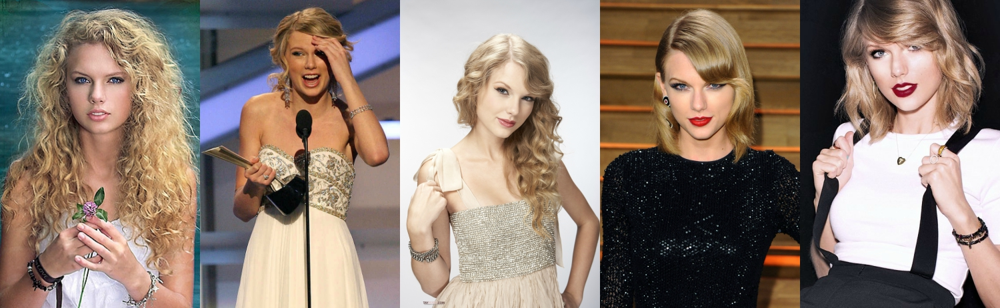

Taylor Swift Song Analysis
================
Bailey Joseph
12/21/2017

 

 

I've been a Taylor Swift fan ever since my mom played *Speak Now* for me in the car on the way to my tennis practice in 8th grade. I couldn't get enough and worked my way though listening to all of her albums almost every day. In the seven years since then, Taylor has changed her style dramatically with each new album she releases. She's also steadily transitioned from country music to pop music, with her first album being true country and 1989 being her first true pop album. I was interested to see how her lyrical tendencies changed over time, so decided to make an analysis on repitition in her songs.

It's not easy to measure just how repetitive a song feels while listening to it, since the way words are paced, pronounced, and arranged (as well as the music itself) can make a big difference. So while there's no one perfect measure for repition in songs, I'll be choosing one that's fairly straightforward and objective. I'll look at the fraction of words in the song that are never repeated (unique). For example, the sentence "two plus two is four" has 5 total words, but only 4 unique words, since "two" is repeated. This gives a fraction of 4/5, or .8. If we change the sentence to "two plus two is two plus two," it becomes obviously more repetitive. Our measure captures this, as there are now 7 total words and only three of them are unique, giving 3/7, or around .43. These decimals are what you'll see on the graphs that follow, so the important thing to note is that lower numbers correspond to more repetitive songs.

Songs will naturally repeat many of their words. Repeating words within adjacent sentences can increase the flow of the song and, of course, the chorus tends to be repeated a few times in its entirety. For this reason, it's best to look at these these songs in relation to each other, rather than try to think about how repetitve a single sentence would need to be in order to match (the song "Out of the Woods" would be something like "two plus two is two plus two is two plus two is two plus two" if it were a single sentence).

This graph shows the repitition in all songs from Taylor's studio albums (including Target bonus tracks and the Platinum edition of Fearless):

As you can see, repition has generally increased (points are farther down) througout Taylor's career.
Her first two albums and *Fearless Platinium* are almost identical (the low outlier in *Fearless Platinum* is "Untouchable" which actually wasn't written by Taylor).
*Speak Now* is pretty similar as well, but much less spread out. This may be because she wrote all those songs entirely by herself, so the songwriting tastes of other artists didn't come in and add variation.
*Red* felt to me like a true blend of country songs and pop songs, and that's reflected by the large amoung of variation.
The last two albums are closer to true pop and have noticably more repition. It is interesting how close together the songs are in *Reputation*. Every song on *Reputation* had co-authors, so this may be more indicitive of the cohesive sound throughout the album than anything else.

To make the overall pattern more clear, let's look at this same plot again, but this time with only one point per album, which represents the average repition of a song in that album. Songs were all given equal weight for this calculation.

If you're like me, the first plot made you curious about which dots correspond to which songs. It would be too messy to include that on the full plot, so we'll take a look at each album by itself and include the names of the songs next to the points. I'll also include the average for each album and the overall average as horizontal lines. Some points have almost exactly the same height, so it's admittedly a challenge to make out the words on every plot.

------------------------------------------------------------------------

------------------------------------------------------------------------

------------------------------------------------------------------------

------------------------------------------------------------------------

------------------------------------------------------------------------

------------------------------------------------------------------------

------------------------------------------------------------------------

I was also curious about what exactly makes certain songs more repitive than others in Taylor's albums. Like I mentioned before, her songs tend to repeat a chorus, possibly many times. I thought that longer songs might be more repitive than shorter songs as they'll repeat lines more often. This relationship ended up holding true, as you can see here:

You can see that as songs get longer, there is a smaller fraction of their words which are unique. Also, you can see that songs on the same album (and therefore the same color) tend to be clustered together on this graph, showing that within each album songs tend to be of a similar length and uniqueness as compared to songs on other albums.

It's interesting to note that this trend is actually not true for all artists. To test this, I imported some lyrics from Drake (my favorite rapper) and performed the same analysis. Notice how the shape is very different:

**Note:** above and in each of the two graphs that follow, I've labelled the name of the shortest song, the longest song, the most repetitive song, and the least repetitive song.

It turns out that in these rap songs, there is essentially no relationship between repitition and length. This made me curious about whether the distinction comes from country and pop versus rap, or because Drake is an outlier in some way. To help answer this, I chose 5 random weeks (one from each of the past five years) and pulled the lyrics from the top 5 pop songs on the charts at that week (leaving off the songs that were from Taylor herself). The shape went back to what we'd expect:

While this relationship is not as strong as the one we saw for Taylor's songs, it does at least follow the same trend.

Next, I wondered if songs that have shorter words tend to be more repetitive. This makes sense, because it's easier to repeat "Are we out of the woods yet" (average word length of 3 letters) than "Distance, timing, breakdown, fighting" (average word length of almost 8 letters).

There is a positive association between the average word length and the fraction of lyrics that are unique.

Next, I was curious about just how many words Taylor uses of each length.

The longest word that appears in any song is **miscommunications** in "The Story of Us."

Taylor Swift's favorite number is 13. She's used 3 different 13 letter words: "condescending," "interruptions," and "heartbreakers." "Heartbreakers" was repeated 3 times.

Interestingly, the shape of this graph is very similar to the distribution we see when we repeat this for Drake songs. For this next graph, the height will be the proportion of words that are each length rather than the number, since I have a different total number of Taylor Swift and Drake words.

While rap and pop songs were very clearly different when looking at how length influences repitition, the words they use are nearly identical in size.

Here's a fun wordcloud for all of Taylor Swift's songs:

The most often used word was "know" with 285 repitions. "Like" was more common than "love" at 280 and 185 repititions, respectively.

To feed into your conspiracy theories, two words that appeared exactly 13 (Taylor Swift's favorite number) times are "perfect" and "words." My reaction to that was "woah" and "magic?" -- two other words that were also repeated 13 times. Before you get carried away though, there were 12 other such words including "laugh," "cold," "sing," "hair," and "tired."

As a final note, I want to distinguish between repitiveness and quality. More repetitive songs can also be catchy and well written. I ranked each song within each album from 1 to the number of songs on the album, then rescaled those from 0 to 10 (because different albums have different numbers of songs). The songs with 0 rating are my favorites from each album, and the songs with 10 are my least favorite.

As you can see, there is almost no relationship whatsoever between how much I like a song and how repititive it is.
